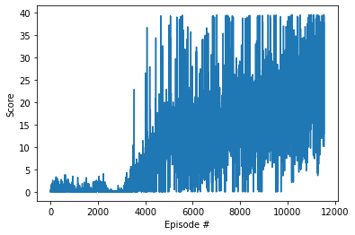
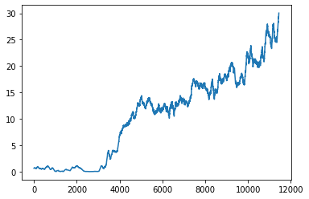

## Report

### Learning Algorithm

This report pertains to the 1-agent version of the environment.

The agent uses the DDPG (Deep Deterministic Policy Gradient) architecture, which is a subset of actor-critic methods. In this architecture, the actor deterministically approximates the optimal policy, mapping states to actions. Meanwhile the critic uses the actor's best believed action to approximate the optimal action value function, thus mapping (state, action) pairs to Q-values. These Q-values are then used to train the actor.

DDPG is intuitively quite similar to DQN (Deep Q-Network) in terms of what it tries to do. Similar to the DQN, it also makes use of a replay buffer and fixed targets; unlike DQN, the targets in DDPG are updated via linear interpolation rather than direct copying.

**Preprocessing**

It has been observed that, out of the 33 dimensions of the state vector, 4 dimensions contain no useful information (i.e. they do not change over the course of an episode, or between episodes). The elements of the state vectors corresponding to these dimensions are hence removed before being fed to the agent.

**Model Architecture**

The actor has an input layer of size 29, corresponding to the size of the post-processed state vector. It then has two fully-connected hidden layers of size 256 and 128, respectively. The output layer has a size of 4, corresponding to the size of the action vector. The two hidden layers have leaky ReLU activations, while the output layer has a tanh activation to ensure its output is within the expected range of \[-1, 1\].

The actor has an input layer of size 29, corresponding to the size of the post-processed state vector. It then has two fully-connected hidden layers of size 256 and 128, respectively. There is another input layer of size 4, corresponding to the size of the action vector; the inputs of this layer are concatenated with the first hidden layer's outputs before being fed to the second layer. The output layer has a size of 1, corresponding to a scalar Q-value. The two hidden layers have leaky ReLU activations, while the output layer has no activation function.

**Hyperparameters**

| Name           	| Function                                         	| Value 	|
|----------------	|--------------------------------------------------	|-------	|
| BUFFER_SIZE    	| Size of replay buffer                            	| 1e6   	|
| BATCH_SIZE     	| Size of minibatch for training                   	| 128   	|
| GAMMA          	| Discount factor                                  	| 0.99  	|
| TAU            	| Rate of soft update of target network parameters 	| 1e-3  	|
| LR_ACTOR       	| Actor learning rate                              	| 1e-4  	|
| LR_CRITIC      	| Critic learning rate                             	| 1e-3  	|
| LEARN_PERIOD   	| Timesteps between training iterations            	| 500   	|
| TIMES_TO_LEARN 	| Minibatches per training iteration               	| 11    	|

### Plot of Rewards

The below plot shows how the rewards received by the agent change as the number of episodes increases.

As the performance is quite noisy, this next plot shows a rolling average (taken over 100 episodes) of the same data.

The problem is solved by the **11541th** episode.

### Ideas for Future Work

The code used in this notebook was adapted from the course materials with minor changes. However, if the standard for solving was raised, hyperparameter selection (for both the actor and critic) using a Gaussian process might be a good way to improve performance. Prioritized experience replay, in which the tuples selected for the training minibatches are selected non-uniformly, might also be a good idea. This is because state transitions that involve moving into or out of the target region (and hence a direct change in the reward received) are likely to be more relevant than other state transitions. Finally, given the nature of the task, it may actually take a while for a new agent with no knowledge to receive its first non-zero reward. The lack of feedback that the agent would receive in the early phases might hinder learning; this can be partially alleviated using random restarts, to find a seed with which the agent quickly receives its first few rewards to kickstart the learning process. Alternatively, a different reward function could be designed that would encourage the agent to take actions beneficial to the task, e.g a reward for moving in the general direction of the target.
